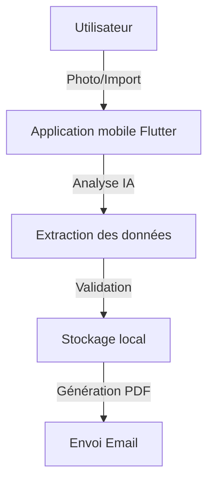
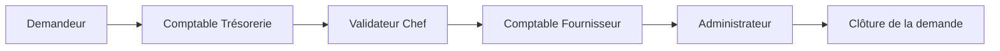

# Rapport de stage 3ICS

---

<!-- PAGE DE GARDE -->

  
  

**Nom de l’élève :** Maxence Bonnet  
**Promotion :** 3ICS  
**Année universitaire :** 2024/2025  
**Spécialité :** Informatique et Cybersécurité  
**Maître de stage :** Juliette Durousset  
**Destinataires :** Jury CPE Lyon, Service Informatique Natecia  
**Entreprise d’accueil :** Hôpital Privé Natecia  
**Titre du rapport :** Développement d’outils numériques pour la gestion des notes de frais et des remboursements clients  
**Titre en anglais :** Development of Digital Tools for Expense and Customer Refund Management  
**Mots-clés :** Gestion, Application mobile, Automatisation, Intelligence Artificielle, Workflow  
**Rapport partiellement confidentiel**

---

# Remerciements

Je tiens à remercier chaleureusement Benoit Gonnet, Juliette Durousset, Philippe NERI, Pascale DIOP et Marie LUPO pour leur accompagnement, leurs conseils et leur implication tout au long de ce stage. Leur aide précieuse, leurs retours et leur disponibilité ont grandement contribué à la réussite de ce projet. Merci également à l’ensemble de l’équipe de l’Hôpital Privé Natecia pour leur accueil et leur confiance.

---

# Résumé

Ce rapport présente le travail réalisé lors de mon stage de 3e année à l’Hôpital Privé Natecia, dans le cadre de la formation ICS à CPE Lyon. L’objectif principal était de concevoir et développer deux solutions logicielles visant à fluidifier la gestion des notes de frais et des demandes de remboursement, en automatisant et en sécurisant les processus existants. Le premier projet, une application mobile développée avec Flutter, permet aux employés de gérer leurs notes de frais et indemnités kilométriques de manière intuitive, grâce à l’intégration d’une intelligence artificielle pour l’analyse automatique des justificatifs. Le second projet, une application de bureau en Python, centralise et trace le processus de remboursement des trop-perçus clients via un workflow multi-utilisateurs et une base de données partagée. Les deux outils sont aujourd’hui utilisés en production. Ce rapport détaille la démarche suivie, les choix techniques, les difficultés rencontrées, les résultats obtenus et propose des perspectives d’évolution pour pérenniser et enrichir ces solutions.

---

# Sommaire

1. [Remerciements](#remerciements)
2. [Résumé](#résumé)
3. [Sommaire](#sommaire)
4. [Table des illustrations](#table-des-illustrations)
5. [Introduction](#introduction)
6. [Développement](#développement)
    1. [Analyse du problème et état de l’art](#analyse-du-problème-et-état-de-lart)
    2. [Solutions envisagées](#solutions-envisagées)
    3. [Solution retenue et justification](#solution-retenue-et-justification)
    4. [Résultats obtenus](#résultats-obtenus)
    5. [Difficultés rencontrées](#difficultés-rencontrées)
7. [Conclusion et perspectives](#conclusion-et-perspectives)
8. [Glossaire](#glossaire)
9. [Bibliographie](#bibliographie)
10. [Annexes](#annexes)

---

# Table des illustrations

1. Schéma d’architecture de l’application mobile ............................................. page X
2. Capture d’écran : Interface de validation des notes de frais .......................... page X
3. Schéma du workflow de l’application de remboursement ............................. page X
4. Capture d’écran : Tableau de bord des statistiques .................................... page X
5. Capture d’écran : Application Python – suivi d’une demande ....................... page X

---

# Introduction

## Mon parcours

Je m’appelle Maxence Bonnet, j’ai 22 ans et je suis actuellement en première année du cycle ingénieur ICS à CPE Lyon. Avant d’intégrer cette formation, j’ai obtenu un BTS SNIR à l’école Eduard Branly, après un baccalauréat STI2D option SIN à l’école LaMache.

## Présentation de l’entreprise

L’Hôpital Privé Natecia, membre du groupe Noalys, est un établissement de santé reconnu à Lyon, spécialisé dans la prise en charge globale des patients. L’entreprise attache une grande importance à l’innovation et à l’optimisation de ses processus internes, notamment dans la gestion administrative et financière.

## Contexte et enjeux du projet

Dans le cadre de la digitalisation de ses processus, Natecia a exprimé le besoin de fluidifier la gestion des notes de frais des employés et des demandes de remboursement des clients. Les méthodes traditionnelles (papier, emails, tableurs) étaient sources de lenteurs, d’erreurs et de difficultés de suivi. L’objectif du stage était donc de concevoir et de mettre en œuvre deux solutions logicielles adaptées à ces problématiques, tout en respectant des contraintes fortes de sécurité, de confidentialité et de coût.

## Objectifs initiaux et missions

- Développer une application mobile pour la gestion automatisée des notes de frais et indemnités kilométriques des employés.
- Concevoir une application de bureau pour centraliser et tracer les demandes de remboursement clients, avec gestion multi-utilisateurs et base de données partagée.

## Structure du rapport

Ce rapport est structuré en plusieurs parties : après une analyse du problème et de l’état de l’art, je présenterai les différentes solutions envisagées, la solution retenue et sa justification, les résultats obtenus, les difficultés rencontrées, puis j’ouvrirai sur les perspectives d’évolution. Un glossaire, une bibliographie et des annexes complètent le document.

---

# Développement

## Analyse du problème et état de l’art

La gestion des notes de frais et des remboursements clients est un enjeu majeur pour les entreprises, tant pour la maîtrise des coûts que pour la satisfaction des collaborateurs et clients. De nombreuses solutions existent sur le marché (ex : Expensya, N2F, Cleemy), mais elles sont souvent coûteuses, peu flexibles ou inadaptées aux besoins spécifiques de Natecia (notamment l’absence de serveur externe imposée par la DSI).

**Schéma 1 : Architecture cible de l’application mobile**

## Solutions envisagées

- Utilisation d’une solution du marché (trop coûteuse, non conforme aux exigences internes)
- Développement d’une application mobile sur mesure (choisie pour la flexibilité et la maîtrise des coûts)
- Pour la gestion des remboursements clients :
    - Utilisation d’un ERP existant (non adapté)
    - Développement d’une application de bureau Python avec base SQLite sur disque réseau (choisie pour la simplicité et l’absence de coût serveur)

## Solution retenue et justification

### Application mobile (notes de frais)

- **Technologies :** Flutter/Dart, IA pour OCR et extraction de données, stockage local, génération PDF, envoi email
- **Avantages :** Adaptée aux besoins, évolutive, interface moderne, coût nul en licence
- **Limites :** Pas de synchronisation en ligne, gestion locale des données, dépendance à la qualité des photos

### Application de bureau (remboursements clients)

- **Technologies :** Python, SQLite, interface graphique, stockage sur disque réseau partagé
- **Avantages :** Centralisation, traçabilité, gestion des rôles, coût nul
- **Limites :** Problèmes potentiels de concurrence sur la base SQLite, dépendance à l’infrastructure réseau

**Schéma 2 : Workflow de validation des demandes de remboursement**

## Résultats obtenus

- Deux applications fonctionnelles, déployées et utilisées par les employés et le service administratif
- Automatisation de l’analyse des justificatifs et du calcul des indemnités kilométriques
- Centralisation et traçabilité des demandes de remboursement clients
- Amélioration de la rapidité et de la fiabilité du traitement des demandes

**[Insérer capture d’écran de l’interface de validation mobile]**

**[Insérer capture d’écran du tableau de bord statistiques]**

**[Insérer capture d’écran de l’application Python – suivi d’une demande]**

## Difficultés rencontrées

- Prise en main de Flutter/Dart et des concepts de développement mobile
- Intégration d’API d’intelligence artificielle pour l’analyse des justificatifs
- Gestion de la base SQLite sur disque réseau partagé (conflits d’accès, verrouillages, risques de corruption)
- Contraintes de sécurité et de confidentialité (pas de serveur externe, gestion des accès)
- Adaptation aux besoins évolutifs des utilisateurs

---

# Conclusion et perspectives

Ce stage m’a permis de développer des compétences techniques et organisationnelles en menant à bien deux projets logiciels à fort impact pour l’entreprise. Les solutions mises en place répondent aux besoins exprimés et sont aujourd’hui utilisées en production. Des perspectives d’évolution existent, notamment :
- Migration vers une base de données centralisée et sécurisée
- Mise en place d’une authentification en ligne et d’un accès multi-supports
- Ajout de fonctionnalités avancées (export comptable, notifications, gestion multi-entreprises)
- Amélioration de l’ergonomie et de l’accessibilité

---

# Glossaire

- **OCR** : Reconnaissance Optique de Caractères (Optical Character Recognition)
- **PDF** : Format de document portable (Portable Document Format)
- **SQLite** : Système de gestion de base de données relationnelle léger
- **Flutter** : Framework de développement d’applications mobiles multiplateformes
- **IA** : Intelligence Artificielle
- **Workflow** : Flux de travail structuré

---

# Bibliographie

- [Documentation Flutter](https://flutter.dev/) (consulté en 2024)
- [Documentation SQLite](https://www.sqlite.org/docs.html) (consulté en 2024)
- [Expensya](https://www.expensya.com/fr/) (consulté en 2024)
- [N2F](https://www.n2f.com/fr/) (consulté en 2024)
- [Cleemy](https://www.lucca.fr/cleemy-notes-de-frais/) (consulté en 2024)

---

# Annexes

## Annexe 1 : Présentation détaillée de l’application mobile

**[Insérer captures d’écran de l’application mobile : page d’accueil, ajout de note, validation, statistiques]**

## Annexe 2 : Présentation détaillée de l’application Python

**[Insérer captures d’écran de l’application Python : création de demande, suivi, historique]**

## Annexe 3 : Extraits de code et schémas techniques

**[Insérer extraits de code commentés et schémas d’architecture]**

---

*Fin du rapport* 